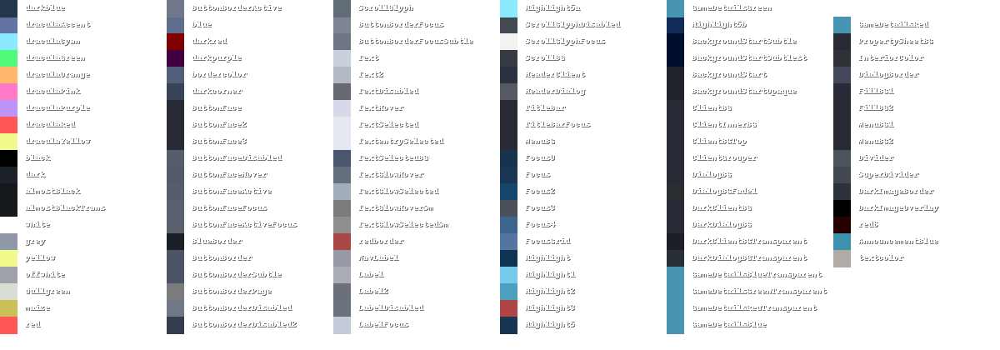

# pywal-steam

this is intended to be a replacement for the no-longer-supported wal_steam project.   

while that project used the Metro skin for steam, this project will be using the Dracula skin.   

## about

still being actively developed

## todo

1. ~~check that paths exist~~  
2. ~~allow custom paths~~  
3. ~~persistence vis config file~~  
4. ~~parse colors from .cache/wal/wal.sh~~  
5. ~~read and write changes to template file~~
6. map out template files for more substantial color changes
7. multiple color configurations as args (--preset1, --preset2, etc)
8. maybe wal -> dracula easy templating via yaml idk
9. ???

## current mapping

